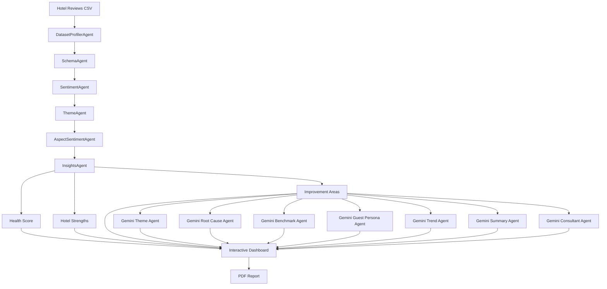
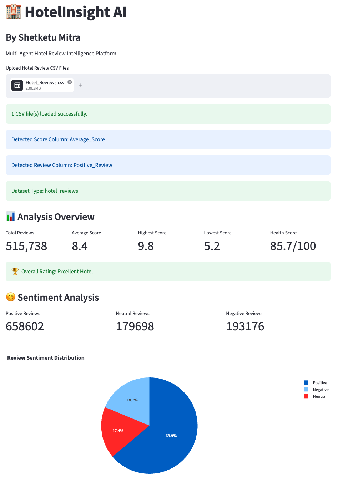
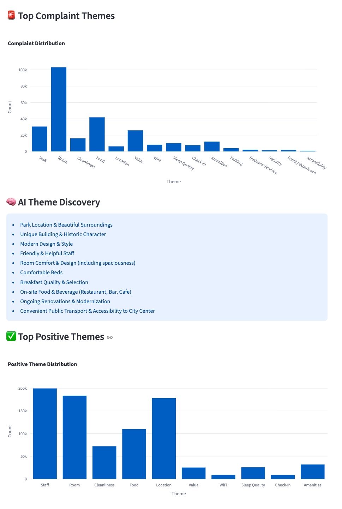
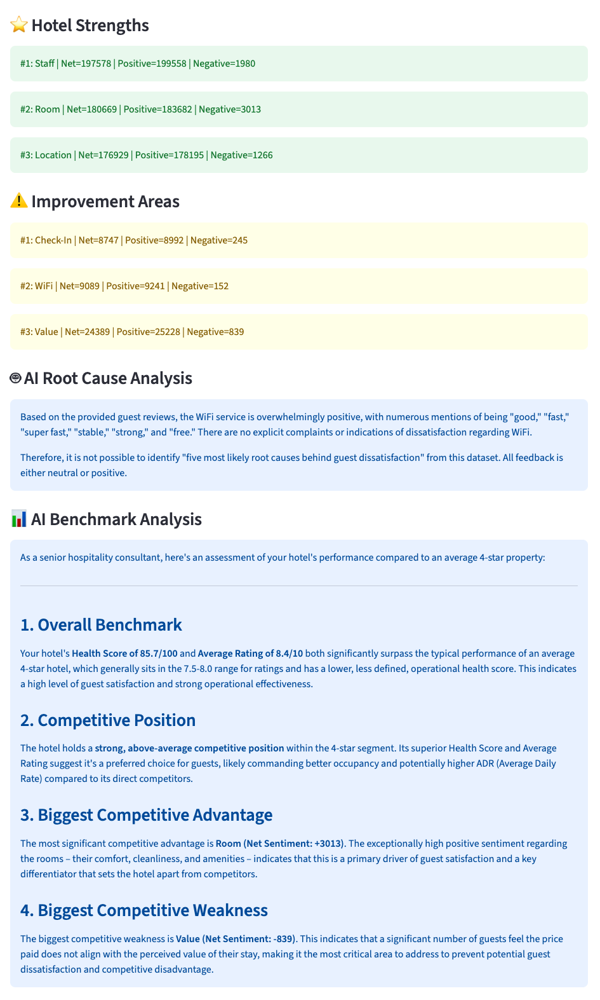
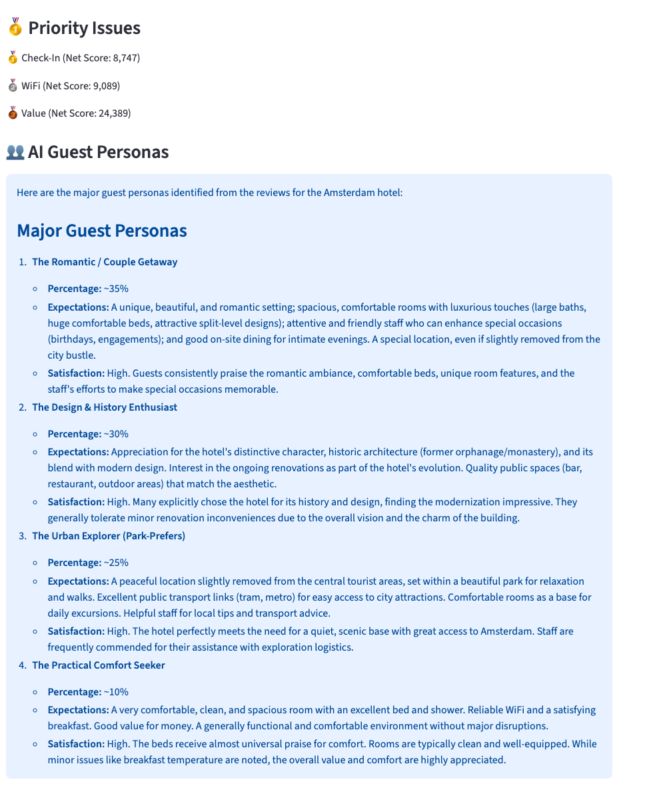
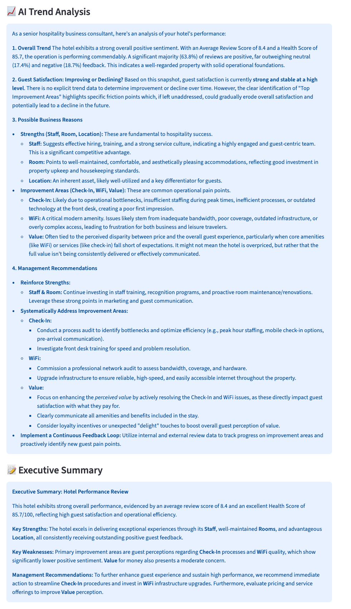
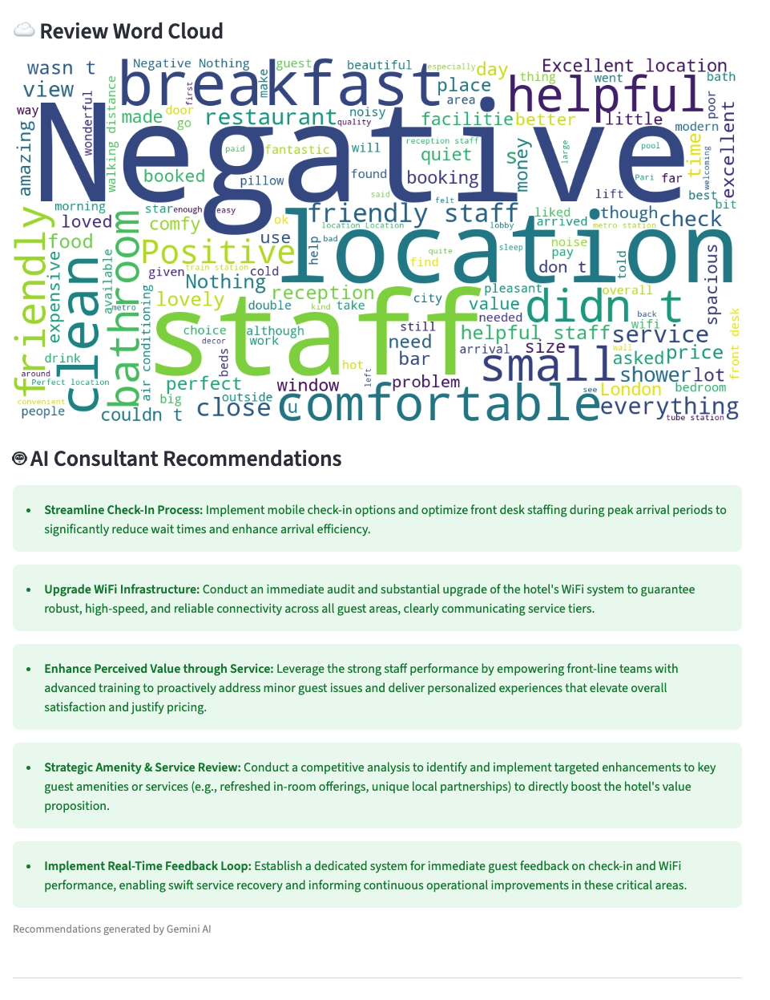
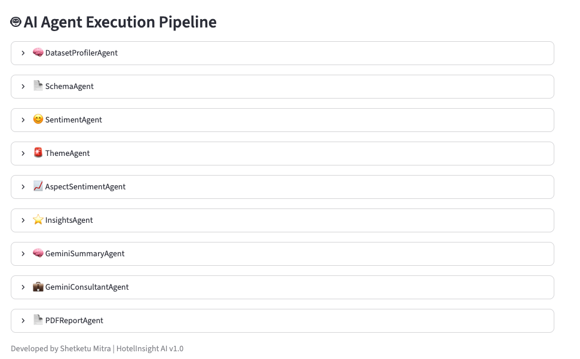

# 🏨 HotelInsight AI

### Multi-Agent Hotel Review Intelligence Platform

**Developed by Shetketu Mitra**

[](https://www.python.org/)
[](https://streamlit.io/)
[](https://ai.google.dev/)
[](LICENSE)

</div>

---


HotelInsight AI is an AI-powered hospitality analytics platform that transforms thousands of hotel guest reviews into actionable business intelligence using a modular multi-agent architecture.

The application combines Natural Language Processing (NLP), sentiment analysis, data visualization, and Google's Gemini AI to automatically identify guest satisfaction trends, complaint themes, strengths, improvement areas, guest personas, strategic recommendations, and executive-level business insights.

---

# Project Overview

HotelInsight AI enables hotel managers, hospitality consultants, and business analysts to upload hotel review datasets and instantly generate comprehensive business intelligence reports.

The platform automatically:

- Performs sentiment analysis
- Detects positive and negative themes
- Calculates hotel health scores
- Discovers guest personas
- Identifies operational strengths
- Detects improvement areas
- Performs AI-powered benchmark analysis
- Generates executive summaries
- Produces consultant-level recommendations
- Exports a professional PDF report

---

# 📑 Table of Contents

- [Project Overview](#project-overview)
- [System Architecture](#-system-architecture)
- [Key Features](#key-features)
- [Multi-Agent Architecture](#multi-agent-architecture)
- [Technologies Used](#technologies-used)
- [Application Screenshots](#application-screenshots)
- [Installation](#installation)
- [Project Structure](#project-structure)
- [Workflow](#workflow)
- [Future Enhancements](#future-enhancements)
- [License](#-license)
- [Author](#author)

---

## 🏗️ System Architecture


---

# Key Features

### Data Processing

- Upload hotel review CSV datasets
- Automatic dataset profiling
- Automatic schema detection
- Automatic review column detection
- Automatic score column detection

### Analytics

- Overall hotel performance metrics
- Sentiment Analysis
- Hotel Health Score
- Positive Theme Detection
- Complaint Theme Detection
- Aspect Sentiment Analysis
- Strength & Improvement Identification

### AI Intelligence (Powered by Gemini)

- AI Theme Discovery
- AI Root Cause Analysis
- AI Benchmark Analysis
- AI Guest Personas
- AI Trend Analysis
- AI Executive Summary
- AI Consultant Recommendations

### Visualization

- Interactive charts
- Pie charts
- Bar charts
- Word Cloud
- KPI Dashboard

### Reporting

- Professional PDF Report Generation

---

# Multi-Agent Architecture

The project follows a modular AI Agent architecture.

Each agent performs a dedicated task independently.

| Agent | Responsibility |
|--------|----------------|
| DatasetProfilerAgent | Dataset profiling |
| SchemaAgent | Schema detection |
| SentimentAgent | Review sentiment analysis |
| ThemeAgent | Complaint theme detection |
| PositiveThemeAgent | Positive theme detection |
| AspectSentimentAgent | Aspect-based sentiment analysis |
| HealthScoreAgent | Hotel health score calculation |
| InsightsAgent | Business insights generation |
| GeminiThemeAgent | AI theme discovery |
| GeminiRootCauseAgent | Root cause analysis |
| GeminiBenchmarkAgent | Benchmark comparison |
| GeminiGuestPersonaAgent | Guest persona generation |
| GeminiTrendAgent | Business trend analysis |
| GeminiSummaryAgent | Executive summary generation |
| GeminiConsultantAgent | Consultant recommendations |
| PDFReportAgent | PDF report generation |

---

# Technologies Used

## Programming Language

- Python 3

## Framework

- Streamlit

## Data Processing

- Pandas

## Data Visualization

- Plotly

## NLP

- TextBlob
- WordCloud

## AI

- Google Gemini API

## PDF Reporting

- ReportLab

---

# Application Screenshots

## Dashboard



---

## Theme Analysis



---

## Strengths & Benchmark Analysis



---

## Guest Persona Analysis



---

## Trend Analysis & Executive Summary



---

## AI Consultant Recommendations



---

## AI Agent Execution Pipeline



---

# Installation

Clone the repository

```bash
git clone https://github.com/shetketumitra/HotelInsightAI.git
```

Move into the project

```bash
cd HotelInsightAI
```

Install dependencies

```bash
pip install -r requirements.txt
```

Create a `.env` file

```
GOOGLE_API_KEY=YOUR_GEMINI_API_KEY
```

Run the application

```bash
streamlit run app.py
```

---

# Project Structure

```
HotelInsightAI/
│
├── agents/
│   ├── aspect_sentiment_agent.py
│   ├── consultant_agent.py
│   ├── dataset_agent.py
│   ├── dataset_profiler_agent.py
│   ├── gemini_benchmark_agent.py
│   ├── gemini_competitor_agent.py
│   ├── gemini_consultant_agent.py
│   ├── gemini_guest_persona_agent.py
│   ├── gemini_root_cause_agent.py
│   ├── gemini_summary_agent.py
│   ├── gemini_theme_agent.py
│   ├── gemini_trend_agent.py
│   ├── health_score_agent.py
│   ├── insights_agent.py
│   ├── pdf_report_agent.py
│   ├── positive_theme_agent.py
│   ├── recommendation_agent.py
│   ├── review_agent.py
│   ├── root_cause_agent.py
│   ├── schema_agent.py
│   ├── sentiment_agent.py
│   ├── summary_agent.py
│   ├── theme_agent.py
│   └── wordcloud_agent.py
│
├── data/
├── reports/
├── images/
├── app.py
├── requirements.txt
└── README.md
```

---

## Workflow

1. Upload hotel review CSV
2. Automatically detect dataset schema
3. Perform sentiment analysis
4. Extract complaint and positive themes
5. Calculate hotel health score
6. Generate business insights
7. Execute Gemini AI agents
8. Display interactive dashboard
9. Export executive PDF report

---

# 💼 Business Value

HotelInsight AI enables hotel operators and hospitality consultants to transform unstructured guest reviews into actionable business intelligence.

The platform supports decision-making by:

- Improving guest satisfaction
- Identifying recurring operational issues
- Benchmarking hotel performance
- Understanding guest personas
- Prioritizing operational improvements
- Supporting strategic business decisions
- Reducing manual review analysis effort

---

# Future Enhancements

- Multi-language review support
- OCR support for PDF reviews
- Competitor benchmarking dashboard
- Real-time review monitoring
- Hotel comparison dashboard
- RAG-powered hotel knowledge base
- Vector database integration
- LangGraph orchestration
- CrewAI multi-agent workflow
- Voice-based AI assistant
- Cloud deployment (AWS / Azure / GCP)

---

# 📌 Project Information

**Project Name:** HotelInsight AI

**Project Type:** Capstone Project

**Domain:** Data Analytics | Business Intelligence | Hospitality Analytics | Artificial Intelligence

---

# 📄 License

This project is licensed under the MIT License.

See the [LICENSE](LICENSE) file for details.

---

# Author

## Shetketu Mitra

Data Analyst | Hospitality Professional | AI & Business Intelligence Enthusiast

GitHub:
https://github.com/shetketumitra

LinkedIn:
https://www.linkedin.com/in/shetketumitra/

---

⭐ If you found this project interesting, please consider giving it a Star on GitHub.
