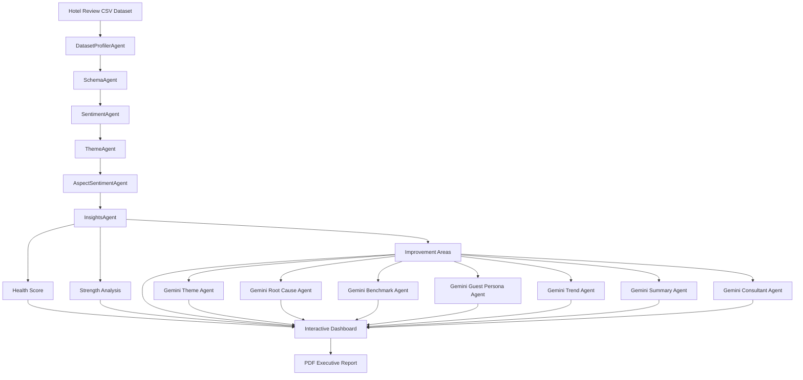

# 🏨 HotelInsight AI

> **Version:** v1.0.0  
> **Developed by:** **Shetketu Mitra**

[](https://www.python.org/)
[](https://streamlit.io/)
[](https://ai.google.dev/)
[](LICENSE)

---

## 🚀 Overview

HotelInsight AI is a **Multi-Agent AI-powered Hotel Review Intelligence Platform** that transforms thousands of guest reviews into actionable business intelligence using **Natural Language Processing (NLP)**, **Business Analytics**, and **Google Gemini AI**.

Designed for hotel managers, hospitality consultants, operations teams, and business analysts, the platform automatically analyzes hotel review datasets to uncover customer sentiment, operational strengths, service gaps, guest personas, benchmarking insights, and executive-level recommendations.

The application combines modular AI agents with interactive visualizations to deliver strategic insights that support data-driven hospitality decision-making.

---

# 🏗 System Architecture



---

# 🎯 Project Objectives

HotelInsight AI aims to:

- Convert unstructured hotel reviews into business intelligence
- Detect customer satisfaction trends
- Perform sentiment and aspect-based analysis
- Discover operational strengths and weaknesses
- Identify guest personas using AI
- Generate strategic consultant-level recommendations
- Produce executive-ready PDF reports
- Enable data-driven hospitality decision-making

---

# ⚙️ AI Agent Pipeline

| Agent | Responsibility |
|--------|----------------|
| 🧠 DatasetProfilerAgent | Detects dataset type and structure |
| 📄 SchemaAgent | Automatically identifies review and score columns |
| 😊 SentimentAgent | Performs sentiment analysis |
| 🚨 ThemeAgent | Extracts complaint and positive themes |
| 📈 AspectSentimentAgent | Performs aspect-level sentiment analysis |
| ⭐ InsightsAgent | Calculates Health Score, strengths and improvement areas |
| 🧠 GeminiThemeAgent | Discovers hidden guest experience themes |
| 🎯 GeminiRootCauseAgent | Performs AI-powered root cause analysis |
| 📊 GeminiBenchmarkAgent | Generates hotel benchmark analysis |
| 👥 GeminiGuestPersonaAgent | Identifies guest personas |
| 📈 GeminiTrendAgent | Produces trend analysis |
| 📝 GeminiSummaryAgent | Creates executive summaries |
| 💼 GeminiConsultantAgent | Generates consultant-level recommendations |
| 📄 PDFReportAgent | Exports executive PDF reports |

---

# 📊 Features

## ✅ Dataset Intelligence

- Automatic dataset profiling
- Automatic schema detection
- Smart review column detection
- Automatic score column detection

---

## 😊 Sentiment Analytics

- Positive review detection
- Neutral review detection
- Negative review detection
- Interactive sentiment visualizations
- Sentiment distribution charts

---

## 🚨 Theme Analysis

- Complaint theme extraction
- Positive theme extraction
- Theme frequency analysis
- AI Theme Discovery

---

## 📈 Business Intelligence

- Hotel Health Score
- Operational strengths
- Improvement areas
- Priority issue ranking
- Executive KPI dashboard

---

## 🤖 Google Gemini AI Analysis

The platform uses Google Gemini to generate:

- AI Theme Discovery
- Root Cause Analysis
- Hotel Benchmark Analysis
- Guest Persona Analysis
- Trend Analysis
- Executive Summary
- Consultant Recommendations

---

## 📄 Report Generation

Generate downloadable management reports including:

- Executive Summary
- Hotel Performance Overview
- Strengths
- Improvement Areas
- AI Insights
- Consultant Recommendations

---

# 📷 Application Screenshots

## Dashboard


---

## Theme Discovery


---

## AI Benchmark Analysis


---

## Guest Persona Analysis


---

## AI Consultant Recommendations


---

# 📈 Workflow

```
Upload Hotel Reviews CSV

↓

Dataset Profiling

↓

Schema Detection

↓

Sentiment Analysis

↓

Theme Extraction

↓

Aspect Sentiment Analysis

↓

Business Insights Generation

↓

Gemini AI Analysis

↓

Interactive Dashboard

↓

Executive PDF Report
```

---

# 🛠 Technology Stack

### Programming

- Python 3.12

### Frontend

- Streamlit

### Data Processing

- Pandas

### Visualization

- Plotly
- WordCloud

### AI

- Google Gemini API

### NLP

- TextBlob

### Reporting

- ReportLab

### Environment

- Python Dotenv

---

# 📂 Project Structure

```
HotelInsightAI/

│

├── agents/

│   ├── dataset_profiler_agent.py
│   ├── schema_agent.py
│   ├── sentiment_agent.py
│   ├── theme_agent.py
│   ├── aspect_sentiment_agent.py
│   ├── insights_agent.py
│   ├── gemini_theme_agent.py
│   ├── gemini_root_cause_agent.py
│   ├── gemini_benchmark_agent.py
│   ├── gemini_guest_persona_agent.py
│   ├── gemini_trend_agent.py
│   ├── gemini_summary_agent.py
│   ├── gemini_consultant_agent.py
│   └── pdf_report_agent.py

│

├── images/

├── app.py

├── requirements.txt

├── LICENSE

└── README.md
```

---

# ⚡ Installation

Clone the repository

```bash
git clone https://github.com/shetketumitra/HotelInsightAI.git
```

Navigate to the project

```bash
cd HotelInsightAI
```

Install dependencies

```bash
pip install -r requirements.txt
```

Configure environment variables

Create a `.env` file

```env
GOOGLE_API_KEY=YOUR_API_KEY
```

Run the application

```bash
streamlit run app.py
```

---

# 💡 Use Cases

HotelInsight AI can be used by:

- Hotel General Managers
- Hospitality Consultants
- Revenue Managers
- Customer Experience Teams
- Operations Managers
- Hotel Owners
- Business Analysts
- Hospitality Researchers

---

# 📌 Future Roadmap (Version 2.0)

- Multi-language review analysis
- Live review monitoring
- Competitor benchmarking using external datasets
- Retrieval-Augmented Generation (RAG)
- Vector Database Integration
- Cloud Deployment
- Docker Support
- CI/CD Pipeline
- Interactive AI Chat Assistant
- Advanced Predictive Analytics

---

# 👨‍💻 About the Developer

**Shetketu Mitra**

Hospitality Professional | Data Analytics Enthusiast | Business Intelligence | Artificial Intelligence

HotelInsight AI combines hospitality domain expertise with AI-driven business analytics to demonstrate how intelligent systems can support strategic decision-making within the hospitality industry.

---

# 📄 License

This project is licensed under the **MIT License**.

See the LICENSE file for details.

---

# ⭐ Acknowledgements

- Google Gemini AI
- Streamlit
- Plotly
- ReportLab
- TextBlob
- Open Source Python Community

---

## 🌟 If you found this project useful, consider giving it a star on GitHub!
