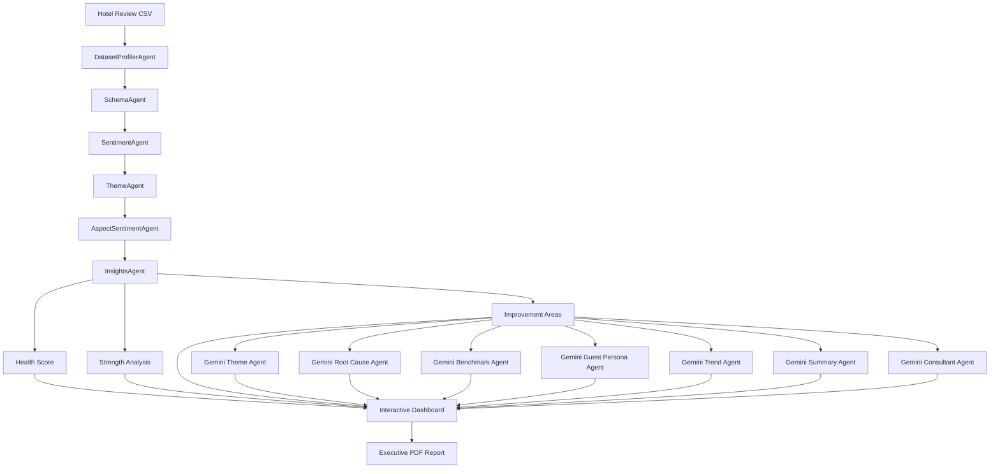

# 🏨 HotelInsight AI

<div align="center">

## Multi-Agent AI-Powered Hotel Review Intelligence Platform

Transform thousands of hotel guest reviews into actionable business intelligence using Artificial Intelligence, Natural Language Processing (NLP), Business Intelligence, and a modular Multi-Agent Architecture.

**Version:** v1.0.0

Developed by **Shetketu Mitra**

[](https://www.python.org/)
[](https://streamlit.io/)
[](https://ai.google.dev/)
[](LICENSE)

</div>

---

# 📌 Project Overview

HotelInsight AI is an AI-powered hospitality analytics platform designed to convert large volumes of hotel guest reviews into meaningful business intelligence.

Built using a modular multi-agent architecture, the platform automatically analyzes customer sentiment, discovers guest experience themes, identifies strengths and operational weaknesses, generates benchmark insights, creates executive summaries, and provides AI-powered consultant recommendations for hotel management.

The project combines:

- Artificial Intelligence
- Natural Language Processing (NLP)
- Business Intelligence
- Data Analytics
- Google Gemini
- Interactive Data Visualization

to help hotel managers and hospitality consultants make data-driven business decisions.

---

# 🚀 Key Features

✅ Upload hotel review datasets

✅ Automatic dataset profiling

✅ Automatic schema detection

✅ Sentiment Analysis

✅ Positive Theme Detection

✅ Complaint Theme Detection

✅ Aspect-level Sentiment Analysis

✅ Hotel Health Score

✅ Hotel Strength Identification

✅ Improvement Area Detection

✅ AI Theme Discovery

✅ AI Root Cause Analysis

✅ AI Benchmark Analysis

✅ AI Guest Persona Discovery

✅ AI Trend Analysis

✅ Executive Summary Generation

✅ AI Consultant Recommendations

✅ Interactive Dashboard

✅ Professional PDF Report Generation

---

# 🏗️ System Architecture



---

# 🤖 AI Agent Pipeline

| Agent | Responsibility |
|---------|----------------|
| DatasetProfilerAgent | Detect dataset type and structure |
| SchemaAgent | Detect review and score columns |
| SentimentAgent | Perform sentiment analysis |
| ThemeAgent | Detect complaint and positive themes |
| AspectSentimentAgent | Calculate aspect-level sentiment |
| InsightsAgent | Calculate health score, strengths and weaknesses |
| GeminiThemeAgent | Discover hidden guest experience themes |
| GeminiRootCauseAgent | Perform AI root cause analysis |
| GeminiBenchmarkAgent | Generate benchmark analysis |
| GeminiGuestPersonaAgent | Discover guest personas |
| GeminiTrendAgent | Perform trend analysis |
| GeminiSummaryAgent | Generate executive summary |
| GeminiConsultantAgent | Generate consultant recommendations |
| PDFReportAgent | Produce executive PDF report |

---

# 🔄 Workflow

1. Upload Hotel Review CSV

2. Detect Dataset Structure

3. Detect Review & Rating Columns

4. Perform Sentiment Analysis

5. Extract Positive & Complaint Themes

6. Calculate Hotel Health Score

7. Identify Strengths & Improvement Areas

8. Execute Gemini AI Agents

9. Generate Business Intelligence Dashboard

10. Export Executive PDF Report

---

# 📊 Dashboard Modules

The application provides:

- Analysis Overview

- Sentiment Analysis

- Complaint Theme Analysis

- AI Theme Discovery

- Positive Theme Analysis

- Hotel Strengths

- Improvement Areas

- AI Root Cause Analysis

- AI Benchmark Analysis

- Priority Issues

- AI Guest Personas

- AI Trend Analysis

- Executive Summary

- AI Consultant Recommendations

- AI Agent Execution Pipeline

- PDF Report Export

---

# 🛠️ Technology Stack

### Programming

- Python

### Web Framework

- Streamlit

### Artificial Intelligence

- Google Gemini

### Data Analysis

- Pandas

### Visualization

- Plotly

- WordCloud

### NLP

- TextBlob

### Report Generation

- ReportLab

### Environment Management

- Python-dotenv

---

# 📂 Project Structure

```
HotelInsightAI/

│

├── agents/

│ ├── dataset_profiler_agent.py

│ ├── schema_agent.py

│ ├── sentiment_agent.py

│ ├── theme_agent.py

│ ├── aspect_sentiment_agent.py

│ ├── insights_agent.py

│ ├── gemini_theme_agent.py

│ ├── gemini_root_cause_agent.py

│ ├── gemini_benchmark_agent.py

│ ├── gemini_guest_persona_agent.py

│ ├── gemini_trend_agent.py

│ ├── gemini_summary_agent.py

│ ├── gemini_consultant_agent.py

│ ├── pdf_report_agent.py

│

├── images/

├── app.py

├── requirements.txt

├── LICENSE

└── README.md
```

---

# 📷 Application Screenshots

## Dashboard


## Theme Discovery


## AI Benchmark Analysis


## AI Guest Personas


## AI Consultant Recommendations


---

# 📈 Business Value

HotelInsight AI enables organizations to:

- Understand guest satisfaction

- Detect operational pain points

- Improve customer experience

- Identify recurring complaint themes

- Discover hidden guest expectations

- Benchmark hotel performance

- Support executive decision making

- Generate consultant-level recommendations

---

# 💻 Installation

Clone the repository

```bash
git clone https://github.com/shetketumitra/HotelInsightAI.git
```

Move into the project

```bash
cd HotelInsightAI
```

Create environment

```bash
conda create -n hotelinsight python=3.12
conda activate hotelinsight
```

Install dependencies

```bash
pip install -r requirements.txt
```

Create a `.env` file

```text
GOOGLE_API_KEY=YOUR_GEMINI_API_KEY
```

Run the application

```bash
streamlit run app.py
```

---

# 🎯 Future Roadmap

Planned improvements after Version 1.0 include:

- Complete AI-generated executive PDF with all analysis sections
- Retrieval-Augmented Generation (RAG) for hotel knowledge retrieval
- Live hotel review API integration
- Multi-language review analysis
- Cloud deployment (Azure / AWS / GCP)
- Docker support
- CI/CD pipeline with GitHub Actions
- Interactive AI chatbot for hotel insights
- Multiple LLM provider support
- Performance optimization for large-scale datasets

---

# 📄 License

This project is licensed under the MIT License.

See the [LICENSE](LICENSE) file for details.

---

# 👨‍💻 Author

**Shetketu Mitra**

**Domain Expertise**

Hospitality Analytics • Aviation Supply Chain Analytics • Business Intelligence • Artificial Intelligence

GitHub:

https://github.com/shetketumitra

LinkedIn:

(Add your LinkedIn URL)

---

# ⭐ Support

If you found this project useful, consider giving it a ⭐ on GitHub.

It helps others discover the project and supports future development.

---

## Version History

| Version | Release Date | Notes |
|----------|--------------|------|
| v1.0.0 | July 2026 | Initial stable release of HotelInsight AI |

---

<div align="center">

### Built with ❤️ using Python, Streamlit and Google Gemini

**HotelInsight AI v1.0.0**

</div>
